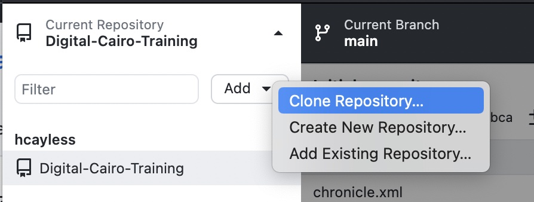

# Digital Cairo: Getting Started

1. Fork this repository.
2. Get a copy of [GitHub Desktop](https://desktop.github.com/) if you don't already have one.
3. Clone a copy of your fork. 

There are two example XML files in this repo for you to play with. [Chronicle.xml](blob/main/chronicle.xml) is a recent English news article, which you can work with in oXygen's Text mode, and [1249.xml](blob/main/articles/arabic/1249.xml) is a version of article [1249](https://github.com/Project-Cairo-Urban-News/CairoUrbanNews/blob/master/articles/arabic/1249.xml) after it was converted from a Word document (so before it was marked up). This one may look ok in Text mode, but you will find it very difficult to work with, so it's better to use Author mode.
